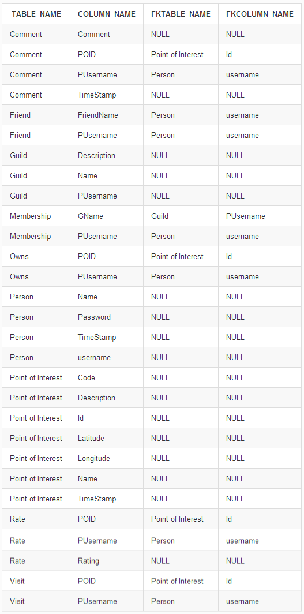

Tables &#8680; Nodes and Relationships
=================================

In the Relational database world, data is organized in Tables (or 
*Relations*). These tables are made up of Columns (*Attributes*) 
and Rows (or *Tuples*). There is also the notion of *Foreign keys*.
These allow data from one table to be consistent with data from another - 
allowing the data in tables to be joined.

Graph databases on the other hand join data in a much more organic way.
The idea of Tuples is thrown out for *Nodes*. These nodes have *Properties*;
properties are similar to columns. As for the graph relative to Foreign 
keys, we have Relationships. However, *Relationships* are much more than 
just a Foreign key: they physically connect Nodes to each other.
Like Nodes, Relationships also can also have properties.

This is just a quick primer for introducing Graph Databases to the a
Relational Database user.

## Conversions 

This section will explain how Tables are going to be converted for 
Neo4j. These are ordered in order of complexity, not number of
Foreign keys... This is why [2 Foreign Keys](#2ForeignKeys) comes before 
[1 Foreign Key](#1ForeignKey).

In this guide, I will be using an [URBEX](http://en.wikipedia.org/wiki/Urban_exploration) 
database as an example. You don't need to have an understanding of
what the database will represent or what the data means to understand
how the conversions are going to be handled.

Running our combined table info query, we gain these as results:

### 0 Foreign Keys -> Node 

If a table has 0 Foreign keys, then a Node will be created.
This is the simplest conversion between SQL Server and Neo4j, because
it doesn't rely on any other data already existing in the database.

This conversion will make a new node with Properties for each
Attribute owned by the Tuple.

### 2 Foreign Keys -> Relationship 

### 1 Foreign Key -> Node with Relationship 

### 3+ Foreign Keys -> Basic node 
